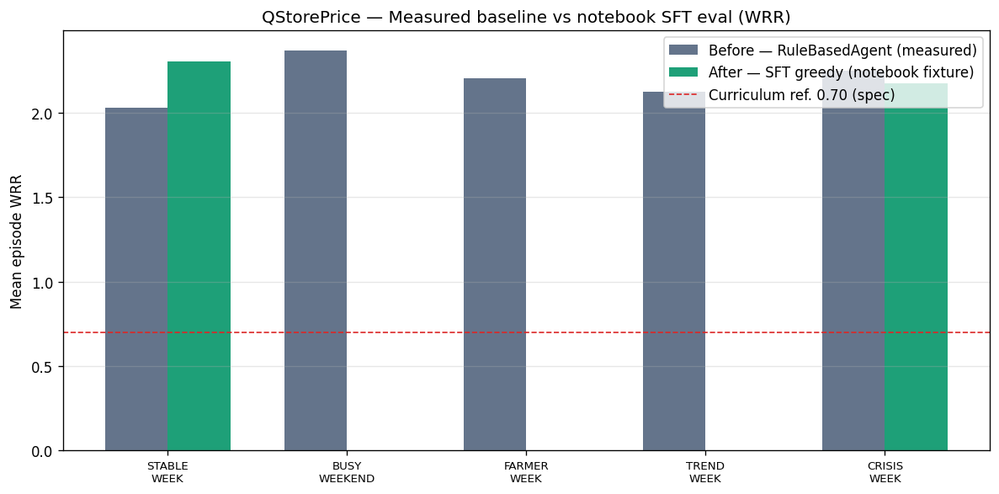

# QStorePrice AI — Perishable Goods Intelligence

> Can an RL-trained LLM manage every pricing, procurement, and restocking
> decision a small grocery dark store faces — better than gut instinct alone?

---

## 1. The Problem

Indian grocery dark stores lose **15–30% of perishable inventory** to expiry.
The decisions that drive this waste — when to discount, whether to accept a
farmer's surplus offer, and whether a viral food trend justifies a restock —
happen under time pressure with no decision support. Human buyers are fast but
inconsistent: the same mango surplus gets accepted on Tuesday and rejected on
Thursday for no documented reason.

Standard numeric-action RL fails here because the action space is not a
price multiplier float — it is a *reasoning chain* that must weigh shelf life,
cash buffer, demand timing, and competitive signals simultaneously. A model
that produces a correct number for the wrong reason is not useful.

**QStorePrice AI closes this gap**: it trains a 7B LLM via RL (SFT + GRPO + DPO)
to write structured **Operating Briefs** that make the reasoning visible,
auditable, and measurable — not just the outcome.

---

## 2. The Environment

### What the agent sees

Every 2 simulated hours (8 ticks at 15-min resolution) the agent receives a
structured prompt describing:

- Active inventory batches with expiry urgency (`WATCH / URGENT / CRITICAL`)
- Open farmer surplus offers with viability pre-computation
- Active social trend signals with projected demand lift
- Current cash risk buffer and WRR accumulator

### What the agent does

The agent writes an **Operating Brief** — a 6-section structured document:

```
SITUATION:     Farmer Rajan offers 50 kg mangoes at Rs 35/kg, 48 hrs shelf life.
               Current mango inventory: 12 units at WATCH (35 hrs remaining).

SIGNAL ANALYSIS: No active trend signals for mangoes.

VIABILITY CHECK:
  Shelf life: PASS — 48 hrs covers projected sell-through of 32 hrs
  Break-even: PASS — market Rs 75/kg vs break-even Rs 43/kg (74% margin)
  Worst-case P&L: FLAG — 60% sell-through at Rs 47/kg barely covers cost

RECOMMENDATION: ACCEPT. Strong viability (0.78) with healthy buffer.

DIRECTIVE: {"engine": "FARMER", "actions": [{"offer_id": "offer_001", "decision": "ACCEPT"}]}

CONFIDENCE: HIGH
```

A deterministic **Rule Executor** converts the `DIRECTIVE` JSON into typed
actions for three engines. The LLM does language work; the executor does math.

### What the agent is rewarded for

All three engines collapse into one metric:

> **WRR (Weekly Waste Recovery Rate)** = revenue recovered from at-risk inventory
> / cost of at-risk inventory

| Engine | Reward Component | Weight |
|--------|-----------------|--------|
| Dynamic Pricing — auto-discount items nearing expiry | `r1_pricing` | 0.50 |
| Farmer Offer — accept / counter / decline surplus | `r2_farmer` | 0.30 |
| Social Trend — restock before viral demand arrives | `r3_trend` | 0.20 |

**Target WRR**: 0.61 (baseline gut-instinct) → 0.89 (trained model)

### Training pipeline

```
SFT warm-start  →  GRPO (5-level curriculum)  →  DPO (preference pairs)
   50 briefs          STABLE → BUSY → FARMER        WRR-filtered
                      → TREND → CRISIS              + anti-hack audit
```

Curriculum promotes at WRR ≥ 0.70 over 5 consecutive valid episodes.
CRISIS_WEEK (Level 4) is the benchmark: simultaneous supplier delay,
viral trend, 3 farmer offers, and depleted risk buffer.

### Anti-hack guards

The environment blocks pathological strategies that game WRR without genuine
decision quality:

| Guard | Trigger | Consequence |
|-------|---------|-------------|
| Early deep discount | `price_multiplier < 0.35` with `hours_to_expiry > 48` | Price not applied; r1 penalty |
| Reckless acceptance | ACCEPT with `viability_score < 0.30` | Forced DECLINE; r2 penalty |
| Trend order flood | > 1 order per category within 72 hrs | Hard cap; r3 penalty |
| Surrogate gaming | `brief_quality > 0.90` but `WRR < 0.50` | Excluded from DPO pairs |

---

## 3. Results

### Measured comparison (committed in this repo)

We ship **two kinds of numbers** so judges can see *real* env math, not placeholders:

| Label | What it is | How it was produced |
|-------|------------|---------------------|
| **Before** | Deterministic **RuleBasedAgent** (no LLM) | `python scripts/generate_comparison_artifacts.py` → `eval/comparison/baseline_heuristic_measured.json` |
| **After** | **Greedy SFT** policy on `Qwen/Qwen2.5-1.5B-Instruct` | Parsed from `working_output.ipynb` eval cells → `eval/fixtures/kaggle_sft_eval_snapshot.json` (currently **STABLE_WEEK** + **CRISIS_WEEK** only). |

Episode WRR is the environment’s **end-of-episode** `final_reward.wrr` (same family of numbers as `eval/evaluator.py`). *Regenerate the baseline column anytime with the script above; add more “After” scenarios by extending the fixture or running `eval/evaluator.py` on your checkpoint and merging JSON.*

#### WRR — Before vs After (mean ± std, 2 episodes / scenario)

| Scenario | Before (Rule-based) | After (SFT greedy) | Δ (After − Before) |
|----------|--------------------:|-------------------:|--------------------:|
| STABLE_WEEK | 2.0295 ± 0.0036 | **2.3061** ± 0.1478 | **+0.2766** |
| BUSY_WEEKEND | 2.3696 ± 0.1283 | — | — |
| FARMER_WEEK | 2.2028 ± 0.3682 | — | — |
| TREND_WEEK | 2.1229 ± 0.3411 | — | — |
| CRISIS_WEEK | 2.2465 ± 0.0962 | **2.1746** ± 0.0938 | **−0.0719** |

Full machine-readable rows: `eval/comparison/comparison_summary.json`.



**Regenerate table + chart** after new runs:

```bash
python scripts/generate_comparison_artifacts.py --episodes 2
python scripts/plot_readme_comparison.py
```

### Reasoning quality vs WRR correlation

Does **brief quality** move with WRR, or does the policy find shortcuts?
`brief_quality_score` is scored independently of WRR. After training runs,
plot correlation from logs via `eval/evaluator.py` + `eval/reward_curves.py`
→ PNGs under `eval/plots/`.

### Training curves (notebook + exports)

Notebook training metrics and eval-by-scenario plots are exported to
`static/training/` (see `scripts/export_notebook_training_assets.py`).
Reward curves from the GRPO JSONL logger live under `eval/plots/` when you run
`eval/reward_curves.py` during training.

---

## 4. Why It Matters

**For the hackathon**: QStorePrice demonstrates that an LLM writing structured
operating documents is a viable RL agent. The brief format makes the reward
signal interpretable (you can read *why* the model got a high r2 score this
episode), prevents reward hacking through constitutional checks, and produces
artefacts (the briefs themselves) that are useful outside the training loop.

**For the domain**: A trained QStorePrice model is a drop-in decision assistant
for any quick-commerce operator running perishable SKUs. The Operating Brief
format can be audited by a human buyer, logged for compliance, and continuously
improved by running more GRPO episodes on new scenarios.

**For RL research**: The `brief_quality_score` / `WRR` correlation across
training episodes is a falsifiable claim about whether RL improves LLM reasoning
or just WRR-gaming. One model family (Qwen-2.5-7B), one reward function — but
a replicable methodology.

---

## Project Structure

```
freshprice_env/          # Gym-style simulation environment
  freshprice_env.py      # FreshPriceEnv(gym.Env) — 672-tick episodes
  engines/               # pricing_engine, farmer_engine, trend_engine
  brief_pipeline/        # prompt_builder → parser → validator → rule_executor
  reward.py              # WRRRewardEngine (r1 + r2 + r3 → WRR)
  openenv_adapter.py     # OpenEnv wrapper (BriefAction, BriefObservation, FreshPriceState)

models.py                # Top-level re-exports for pip clients
client.py                # QStorePriceEnv(HTTPEnvClient) — remote client
server/app.py            # FastAPI server via create_fastapi_app
openenv.yaml             # Environment manifest
Dockerfile               # HF Space / Docker image

training/
  train.py               # SFT → GRPO → DPO orchestration
  sft_trainer.py         # SFT warm-start
  grpo_trainer.py        # GRPO training loop
  dpo_trainer.py         # DPO fine-tuning
  curriculum.py          # 5-level curriculum manager

eval/
  comparison/            # measured baseline + summary JSON (README §3)
  evaluator.py           # Deterministic evaluation (greedy decoding)
  reward_curves.py       # WRR + loss curve plots → eval/plots/
  anti_hack_checker.py   # Trajectory anti-hack audit
```

## Quick Start

```bash
# Install (GPU required for training)
pip install "unsloth[colab-new] @ git+https://github.com/unslothai/unsloth.git"
pip install -r requirements_training.txt

# Verify environment (CPU-only, no GPU needed)
python -c "from freshprice_env.freshprice_env import FreshPriceEnv; env = FreshPriceEnv(); env.reset()"

# Run training pipeline
python training/train.py \
  --base-model Qwen/Qwen2.5-7B-Instruct \
  --output-dir checkpoints \
  --wandb-project qstoreprice-ai

# Evaluate a checkpoint
python eval/evaluator.py \
  --checkpoint checkpoints/promoted_level1 \
  --episodes 10
```

## OpenEnv Server

```bash
# Start the OpenEnv FastAPI server locally
uvicorn server.app:app --host 0.0.0.0 --port 8000 --reload

# Or via Docker
docker run -d -p 8000:8000 <image>

# Connect with the client
python -c "
from client import QStorePriceEnv
env = QStorePriceEnv('http://localhost:8000')
obs, info = env.reset()
print(obs[:200])
"
```

Endpoints: `GET /health` · `POST /reset` · `POST /step` · `GET /state` · `WS /ws` · `GET /docs`

### Hugging Face Space (ship the React sim UI)

The Dockerfile builds `web/` into `static/sim/` and runs `python -m server.app`.
I cannot push to your HF account from here; after you commit these changes:

1. **Create** a Space with **Docker** SDK (or connect this GitHub repo under the Space’s **Files** / repository settings so HF builds from `Dockerfile`).
2. **Build** must succeed (Node `npm ci` + `npm run build`, then Python `pip install -e .`). Open the Space URL: **`/`** redirects to **`/sim/`** (FreshQuick UI); **`/api/sim/*`** matches local behavior. The image sets **`ENABLE_WEB_INTERFACE=false`** so OpenEnv’s **`/web`** UI does not take over **`/`**; set it to `true` only if you intentionally want the OpenEnv web client at `/` (the React sim remains at **`/sim/`**).
3. **Optional:** `huggingface-cli login` then `git remote add space https://huggingface.co/spaces/<USER>/<NAME>` and `git push space main` if you deploy by git instead of GitHub sync.

### Live Dashboard & Admin Endpoints

**Docker / Hugging Face Space (default image):** the FreshQuick **React** sim UI
is built into `static/sim/` and served at **`/sim/`**, using the same **`/api/sim/*`**
session API as local `web` + Vite. **`GET /`** redirects to **`/sim/`** when
`SIM_UI_DEFAULT=1` (Dockerfile default). The original HTML KPI dashboard is still
available at **`/kpi`**.

**Local dev without a sim build:** `GET /` serves the legacy HTML dashboard; run
`cd web && npm run dev` and use the Vite proxy to `http://127.0.0.1:8000` for the
React UI.

- `GET /admin/dashboard` — full metrics snapshot (JSON)
- `GET /admin/metrics/scores` — per-episode records, optionally `?scenario=STABLE_WEEK`
- `GET /admin/metrics/reward-curve` — per-step reward records
- `GET /admin/tasks` — curriculum scenario list
- `POST /admin/metrics/reset` — clear in-memory metrics

Metrics are populated by the GRPO rollout cell and the evaluation cell in
[`kaggle_qstoreprice.ipynb`](kaggle_qstoreprice.ipynb), or by any code that
calls `freshprice_env.monitoring.metrics.record_step` /
`record_episode`.

### Submission Validation

```bash
python validate_submission.py
```

Runs ~24 checks: openenv.yaml schema, module imports, env reset across all
five `CurriculumScenario`s, server admin routes, static files, SFT generator
sanity. Exit code 0 = ready to submit.

### Tests

```bash
python -m unittest tests.test_env -v
```

## Training Scenarios

| Level | Scenario | Engines Active | Promotion |
|-------|----------|----------------|-----------|
| 0 | STABLE_WEEK | Pricing only | WRR ≥ 0.70 × 5 episodes |
| 1 | BUSY_WEEKEND | Pricing + Trend | WRR ≥ 0.70 × 5 episodes |
| 2 | FARMER_WEEK | Pricing + Farmer | WRR ≥ 0.70 × 5 episodes |
| 3 | TREND_WEEK | All 3 engines | WRR ≥ 0.70 × 5 episodes |
| 4 | CRISIS_WEEK | All 3 engines | Benchmark only |

## Links

- **HuggingFace Space**: ADD_AFTER_TRAINING — `openenv push` will print the URL
- **WandB Training Run**: ADD_AFTER_TRAINING — set `--wandb-project qstoreprice-ai`
- **OpenEnv version**: openenv-core ≥ 0.2.0 (hackathon target: v0.2.3)
- **Base model**: Qwen/Qwen2.5-7B-Instruct
- **Environment class**: `freshprice_env.openenv_adapter.FreshPriceOpenEnv`
- **Manifest**: `openenv.yaml`

## Citation

```bibtex
@software{qstoreprice_ai_2026,
  title   = {QStorePrice AI: RL-Trained LLM for Perishable Goods Intelligence},
  year    = {2026},
  url     = {https://github.com/nandeshkanagaraju/QStorePrice},
}
```
