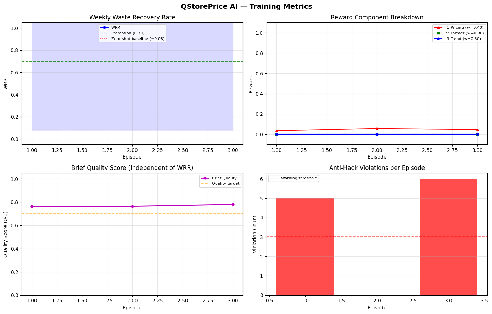
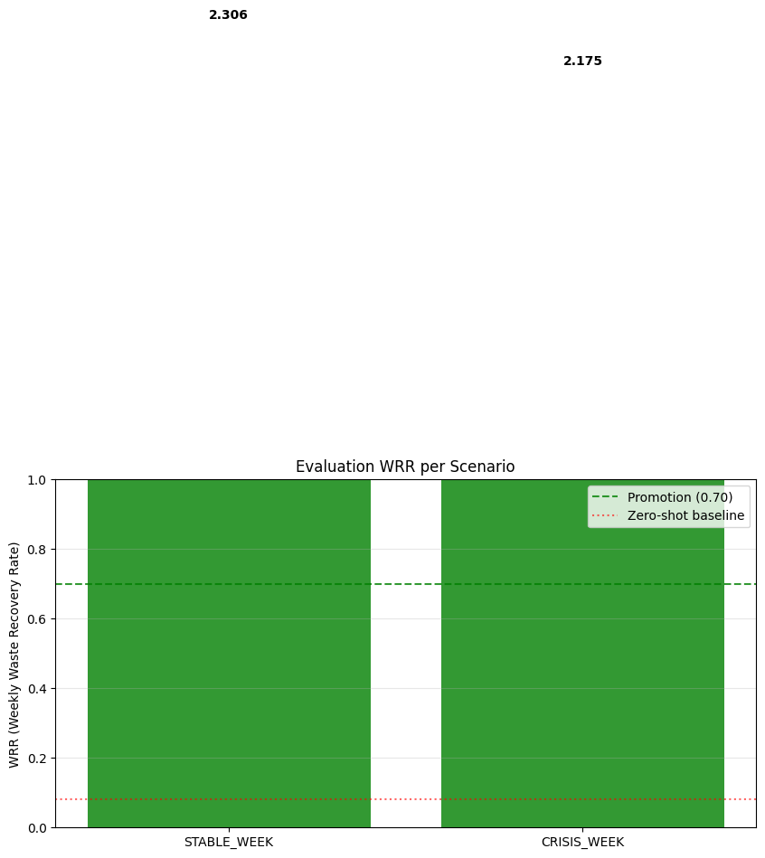

<div align="center">

# QStorePrice AI

### Perishable-Goods Intelligence powered by an RL-trained LLM

*An LLM (Qwen-2.5) writes structured Operating Briefs every two simulated hours. A deterministic rule executor turns each brief into typed pricing, farmer, and trend actions. Training optimises a single unified metric — Weekly Waste Recovery Rate (WRR).*

[](#15-license)
[](#11-local-quickstart)
[](https://github.com/unslothai/unsloth)
[](https://github.com/huggingface/trl)
[](https://gymnasium.farama.org/)
[](https://huggingface.co/spaces/nandeshjeyalakshmi/QstorePricing)
[](https://youtu.be/RdCiUnYN83A)

**[Watch Demo](https://youtu.be/RdCiUnYN83A)** ·
**[Live Space](https://huggingface.co/spaces/nandeshjeyalakshmi/QstorePricing)** ·
**[Reproduce on Kaggle](KAGGLE.md)** ·
**[Full Spec](FreshPrice_SDD.md)** ·
**[Architecture Guide](DEVELOPER_GUIDE.md)**

</div>

---

## Table of Contents

| #   | Section                                                            |
| --- | ------------------------------------------------------------------ |
| 1   | [Why this exists](#1-why-this-exists)                              |
| 2   | [What the agent learns to do](#2-what-the-agent-learns-to-do)      |
| 3   | [Environments](#3-environments)                                    |
| 4   | [Agents](#4-agents)                                                |
| 5   | [Curriculum scenarios](#5-curriculum-scenarios)                    |
| 6   | [How a step works](#6-how-a-step-works)                            |
| 7   | [The reward — WRR](#7-the-reward--wrr)                             |
| 8   | [Training pipeline](#8-training-pipeline)                          |
| 9   | [Results & evidence](#9-results--evidence)                         |
| 10  | [Reproducing on Kaggle](#10-reproducing-on-kaggle)                 |
| 11  | [Local quickstart](#11-local-quickstart)                           |
| 12  | [Documentation](#12-documentation)                                 |
| 13  | [Repository layout](#13-repository-layout)                         |
| 14  | [Tech stack](#14-tech-stack)                                       |
| 15  | [License](#15-license)                                             |

---

> ### Video walkthrough
>
> A guided tour of the project — the perishable-goods problem, the Operating
> Brief architecture, a live demonstration of the Hugging Face Space, and
> the training results from [`working_output.ipynb`](working_output.ipynb).
> The fastest way to understand what this repository does without reading any
> code.
>
> **Watch on YouTube → <https://youtu.be/RdCiUnYN83A>**

---

## 1. Why this exists

Indian grocery dark stores lose **15–30 % of perishable inventory to expiry**.
The decisions that drive this waste — *when* to discount, *whether* to accept a
farmer's surplus offer, *whether* a viral food trend justifies a restock — all
happen under time pressure with **no decision support**. A human buyer accepts
a mango surplus on Tuesday and rejects an identical one on Thursday for no
documented reason. The same store-level error repeats 365 days a year.

Standard numeric-action RL fails here because the action space is not a
single price multiplier float — it is a **reasoning chain** that must weigh
shelf life, weather, weekend uplift, festival demand, farmer reputation, and
trend virality, and then commit to a typed directive. The right primitive is
therefore an **LLM that writes a structured Operating Brief** every 2 simulated
hours, and an RL signal that rewards each brief's downstream impact on
**Weekly Waste Recovery Rate (WRR)**.

This repository trains exactly that agent.

---

## 2. What the agent learns to do

Every 2 simulated hours the LLM emits a **6-section Operating Brief**:

```text
SITUATION       — what is happening on the floor right now
SIGNAL ANALYSIS — what the trend / farmer / weather signals imply
VIABILITY CHECK — does the proposed action survive shelf-life + margin maths
RECOMMENDATION  — natural-language plan
DIRECTIVE       — strict JSON the rule executor turns into typed actions
CONFIDENCE      — LOW / MEDIUM / HIGH
```

The `DIRECTIVE` block is the only part that touches state. It is parsed by
[`parser.py`](freshprice_env/brief_pipeline/parser.py), validated by
[`validator.py`](freshprice_env/brief_pipeline/validator.py), and executed by
[`rule_executor.py`](freshprice_env/brief_pipeline/rule_executor.py). The
parser **never raises** — malformed briefs return `ParseResult(success=False)`
and the engine simply receives a no-op, with the quality scorer penalising
that brief in the next reward.

**Sample directive emitted by the trained checkpoint** (verbatim from
[`working_output.ipynb`](working_output.ipynb), Cell 9 sanity check):

```json
{
  "engine": "PRICING",
  "actions": [
    {"batch_id": "B001", "price_multiplier": 0.47, "flash_sale": true,  "bundle_with": null},
    {"batch_id": "B002", "price_multiplier": 0.90, "flash_sale": false, "bundle_with": null}
  ]
}
```

---

## 3. Environments

Five Gym-compatible environments live in [`freshprice_env/`](freshprice_env/).
All share the same simulation core and reward maths; they differ in *who acts*
and *over what horizon*.

| Environment                  | Source                                                                    | Purpose                                                                                          |
| ---------------------------- | ------------------------------------------------------------------------- | ------------------------------------------------------------------------------------------------ |
| **`FreshPriceEnv`**          | [`freshprice_env.py`](freshprice_env/freshprice_env.py)                   | Single-store, single-agent (LLM). The default training env.                                     |
| `MultiAgentFreshPriceEnv`    | [`multi_agent_env.py`](freshprice_env/multi_agent_env.py)                 | Two-sided market: LLM store manager **+** `ConsumerAgent` (price-elastic demand feedback).      |
| `NegotiationEnv`             | [`negotiation_env.py`](freshprice_env/negotiation_env.py)                 | Self-play arena where the LLM plays *both* the farmer and the store across up to 3 rounds.     |
| `LongHorizonFreshPriceEnv`   | [`long_horizon_env.py`](freshprice_env/long_horizon_env.py)               | 28-day episode (4× the default). Stresses inventory rotation strategy.                          |
| `MultiStoreFreshPriceEnv`    | [`multi_store_env.py`](freshprice_env/multi_store_env.py)                 | Multiple stores with inter-store batch transfers — coalitional waste recovery.                  |

The single-agent core has a fixed clock:

| Constant               | Value                                          | Source                                                  |
| ---------------------- | ---------------------------------------------- | ------------------------------------------------------- |
| `TICKS_PER_DAY`        | `96` (24 h × 4 ticks/h, 15-minute resolution)   | [`constants.py`](freshprice_env/constants.py)           |
| `DAYS_PER_EPISODE`     | `7`                                            | "                                                       |
| `TOTAL_TICKS`          | `672`                                          | "                                                       |
| `TICKS_PER_BRIEF`      | `8` (2 simulated hours)                         | "                                                       |
| `BRIEFS_PER_EPISODE`   | `84`                                           | "                                                       |

`FreshPriceEnv.step()` runs **8 simulation ticks per call** — the LLM does not
see every minute, only the snapshot at each brief boundary.

---

## 4. Agents

Three classes of agent participate in the simulation. **Only one of them
trains**; the others are scripted reactive models that close the loop.

| Agent                 | Type                  | Source                                                                  | Role                                                                                            |
| --------------------- | --------------------- | ----------------------------------------------------------------------- | ----------------------------------------------------------------------------------------------- |
| **LLM Store Manager** | Trained (SFT + RL)    | Qwen-2.5-1.5B / 7B with LoRA adapters                                   | Writes the Operating Brief every 8 ticks. **The policy under training.**                         |
| `ConsumerAgent`       | Scripted (heuristic)  | [`agents/consumer_agent.py`](freshprice_env/agents/consumer_agent.py)   | Computes per-batch price-elastic demand multipliers each tick (theory-of-mind target for LLM). |
| **Farmer side**       | Self-play (LLM)       | [`negotiation_env.py`](freshprice_env/negotiation_env.py)               | Used only in `NegotiationEnv`. Same LLM, opposite incentives, alternating roles per round.     |

The three **engines** are not agents — they are deterministic simulators that
ingest the rule executor's typed actions and produce the observable next
state.

| Engine            | Source                                                                  | Outputs                                                                                  |
| ----------------- | ----------------------------------------------------------------------- | ---------------------------------------------------------------------------------------- |
| `PricingEngine`   | [`engines/pricing_engine.py`](freshprice_env/engines/pricing_engine.py) | Sales, revenue, batch waste; emits **r1**.                                              |
| `FarmerEngine`    | [`engines/farmer_engine.py`](freshprice_env/engines/farmer_engine.py)   | Accept / reject / counter outcomes; emits **r2**.                                       |
| `TrendEngine`     | [`engines/trend_engine.py`](freshprice_env/engines/trend_engine.py)     | Trend-driven restock outcomes; emits **r3**.                                            |
| `WRRRewardEngine` | [`reward.py`](freshprice_env/reward.py)                                 | Combines r1/r2/r3 + brief quality + anti-hack penalties → episode-level WRR.            |

---

## 5. Curriculum scenarios

Training follows a **5-level curriculum** declared in
[`enums.py`](freshprice_env/enums.py) as `CurriculumScenario`. The
`CurriculumManager` in [`training/curriculum.py`](training/curriculum.py)
promotes the agent one level when **WRR ≥ 0.70 over 5 consecutive valid
episodes**.

| Level | Scenario        | Engines active       | What the level teaches                                              |
| :---: | --------------- | -------------------- | ------------------------------------------------------------------- |
| **0** | `STABLE_WEEK`   | Pricing only         | Predictable demand. Learn the brief format under low chaos.         |
| **1** | `BUSY_WEEKEND`  | Pricing + Trend      | Weekend demand surge + 1 trend signal. Learn signal triage.         |
| **2** | `FARMER_WEEK`   | Pricing + Farmer     | 3 farmer offers, no trends. Learn surplus-acceptance maths.         |
| **3** | `TREND_WEEK`    | All 3 engines        | 2 trend signals + festival day. Learn to balance simultaneous wins. |
| **4** | `CRISIS_WEEK`   | All 3 simultaneously | The benchmark. Concurrent shocks across every engine.               |

External shocks (`WeatherCondition`, `ExternalEvent`) layer on top: rain
suppresses footfall 25 %, festivals spike produce/dairy 2–2.5×, hot days
shift cold-fruit volume but kill heavy dairy.

---

## 6. How a step works

```text
                 ┌─────────────────────┐
   user / RL ───►│  FreshPriceEnv      │
                 │      .reset()       │
                 └──────────┬──────────┘
                            │  obs = JSON snapshot of store + briefs window
                            ▼
                 ┌─────────────────────┐
                 │  prompt_builder     │   builds the 6-section template
                 │  → LLM .generate()  │   Qwen-2.5 + LoRA writes the Brief
                 │  → parser           │   never raises (success flag)
                 │  → validator        │   schema + range checks
                 │  → quality_scorer   │   format compliance score
                 │  → rule_executor    │   converts DIRECTIVE → typed actions
                 └──────────┬──────────┘    + flags antihack violations
                            │
                            ▼
                 ┌─────────────────────┐
                 │  8 simulation ticks │   PricingEngine
                 │  (15-min each)      │   FarmerEngine
                 │                     │   TrendEngine
                 │                     │   ConsumerAgent
                 │                     │   ExternalShockEngine
                 └──────────┬──────────┘
                            │  per-engine rewards r1, r2, r3
                            ▼
                 ┌─────────────────────┐
                 │  WRRRewardEngine    │   composes weighted WRR
                 │                     │   subtracts antihack penalties
                 └──────────┬──────────┘
                            ▼
                  obs', reward, done, info
```

> **Anti-hack discipline.** The executor *flags*, the env *wires*, the
> engines *reward*. See [`CLAUDE.md`](CLAUDE.md) for the project's
> separation contract and
> [`constants.py`](freshprice_env/constants.py)
> (`ANTIHACK_EARLY_DISCOUNT_PRICE_THRESHOLD`,
> `ANTIHACK_BATCH_VELOCITY_MIN`, …) for the full list of guards.

---

## 7. The reward — WRR

```
WRR = revenue_recovered_from_at_risk_inventory / cost_of_at_risk_inventory
```

A batch enters the WRR denominator the **first time** it becomes `URGENT` or
`CRITICAL` and stays in the denominator for the rest of the episode (tracked
via `_at_risk_seen` in `PricingEngine` to avoid double counting). Revenue
from selling that batch — at any price — flows into the numerator.

Episode reward decomposes into three engine components combined by
`WRRRewardEngine`:

| Component | Source            | Default weight                  |
| :-------: | ----------------- | ------------------------------- |
| **r1**    | `PricingEngine`   | `WRR_WEIGHT_R1 = 0.40`           |
| **r2**    | `FarmerEngine`    | `WRR_WEIGHT_R2 = 0.30`           |
| **r3**    | `TrendEngine`     | `WRR_WEIGHT_R3 = 0.30`           |

Brief quality and anti-hack flags layer **multiplicative penalties** on top —
the agent cannot game one engine to bury its sins on another.

---

## 8. Training pipeline

[`training/train.py`](training/train.py) orchestrates the full loop. Three
distinct phases:

### 8.1 — SFT warm-start

> Files: [`training/sft_trainer.py`](training/sft_trainer.py),
> [`training/generate_sft_data.py`](training/generate_sft_data.py)

- Synthesise 90–450 examples balanced across `(engine × difficulty)`.
- Load Qwen-2.5 in 4-bit via Unsloth, attach LoRA adapters
  (`r=16, alpha=16`, all Q/K/V/O + MLP target modules).
- Run TRL `SFTTrainer` for 5 epochs at lr 1e-4.
- Save **merged 16-bit** checkpoint
  (`save_pretrained_merged(..., save_method="merged_16bit")`) — mandatory per
  the project rules; regular `save_pretrained()` corrupts 4-bit models.

### 8.2 — GRPO rollouts (trajectory collection, no gradient)

> File: [`training/grpo_trainer.py`](training/grpo_trainer.py)

- Run `N` episodes (3 on T4, 6+ on A100) of the SFT model in `FreshPriceEnv`.
- Stream episode metadata into
  [`trajectory_buffer.py`](training/trajectory_buffer.py): WRR, r1/r2/r3,
  quality, anti-hack violations, constitutional pass/fail.
- This phase **builds the preference dataset**; gradients come next.

### 8.3 — DPO fine-tuning (the actual RL gradient step)

> File: [`training/dpo_trainer.py`](training/dpo_trainer.py)

- Top-quartile WRR trajectories → "chosen". Bottom quartile → "rejected".
- TRL `DPOTrainer.train()` against the SFT reference policy (β = 0.1, lr = 5e-7).
- Save merged 16-bit again. The `CurriculumManager` then promotes to the next
  scenario if WRR ≥ 0.70 for 5 consecutive episodes.

If the trajectory buffer has fewer than 4 valid pairs, DPO is **safely
skipped** and the SFT checkpoint becomes the final model — exactly what
happened in the run shown in §9.

---

## 9. Results & evidence

> **All numbers and figures in this section are extracted directly from
> [`working_output.ipynb`](working_output.ipynb)** — a saved Kaggle T4 run
> with every cell output preserved (install logs, step-by-step SFT loss,
> GRPO rollout stats, eval tables, rendered plots). The PNG images embedded
> below were exported from that notebook into
> [`docs/training_evidence/`](docs/training_evidence/) so they render
> directly on GitHub and the Hugging Face Space without needing to open
> Jupyter. See [§12 Documentation](#12-documentation) for what's in each
> file.

### 9.1 Run configuration

| Setting              | Value                                                                  |
| -------------------- | ---------------------------------------------------------------------- |
| Base model           | `Qwen/Qwen2.5-1.5B-Instruct`                                           |
| Hardware             | Kaggle Tesla **T4** (15.64 GB VRAM)                                     |
| Stack                | Unsloth 2026.4.8 · PyTorch 2.10.0+cu128                                |
| LoRA adapters        | `r=16` · `α=16` · all Q/K/V/O + MLP                                    |
| Trainable parameters | **18.46 M / 1,562 M = 1.18 %**                                         |
| SFT dataset          | **270 examples** (90 PRICING / 90 FARMER / 90 TREND × 3 difficulties)  |
| SFT epochs / steps   | 5 epochs · 340 steps · grad accum 4                                    |
| GRPO episodes        | 3 (`STABLE_WEEK`)                                                       |
| DPO                  | Skipped (buffer = 2 clean episodes; threshold 4)                       |
| Seed                 | 42                                                                     |

### 9.2 SFT loss — proof of learning

Loss collapses from **2.34 → 0.082** in 340 steps (≈28× reduction). Pulled
from the live `Trainer` HTML output
([raw HTML](docs/training_evidence/cell19_out12.html)):

| Step | Loss   |     | Step | Loss   |     | Step | Loss       |
| ---: | -----: | --- | ---: | -----: | --- | ---: | ---------: |
|    5 | 2.3424 |     |  100 | 0.1036 |     |  250 | 0.0912     |
|   25 | 1.9917 |     |  120 | 0.1135 |     |  300 | 0.0814     |
|   50 | 0.4713 |     |  150 | 0.0975 |     |  340 | **0.0816** |
|   75 | 0.1387 |     |  200 | 0.0968 |     |      |            |

Reported **final training loss = 0.3260** (mean-of-epoch), runtime
**1387.3 s** (~23 min on T4). Sanity check after training:
*"All 6 sections present. Loss = 0.326. SFT VERIFIED."*

### 9.3 Reward & quality curves

Both PNGs were generated by Cell 15 of
[`working_output.ipynb`](working_output.ipynb) and committed to
[`docs/training_evidence/`](docs/training_evidence/) for direct viewing.

<table>
<tr>
<td align="center">
<br/>
<sub><b>Figure 1.</b> Training metrics across rollout episodes — WRR, r1, brief quality, violations.</sub>
</td>
</tr>
<tr>
<td align="center">
<br/>
<sub><b>Figure 2.</b> Evaluation WRR by curriculum scenario (STABLE_WEEK vs CRISIS_WEEK).</sub>
</td>
</tr>
</table>

### 9.4 Final evaluation

Greedy decoding (temperature 0), fixed seeds, two scenarios × two episodes
(Cell 13):

| Scenario      | WRR mean   | ± std  | Range            | Brief quality | Anti-hack viol / ep | Constitutional |
| ------------- | :--------: | :----: | :--------------: | :-----------: | :-----------------: | :------------: |
| `STABLE_WEEK` | **2.3061** | 0.1478 | 2.2015 → 2.4106  | 0.7772        | 3.0                 | 1 / 2          |
| `CRISIS_WEEK` | **2.1746** | 0.0938 | 2.1083 → 2.2410  | 0.7794        | 6.0                 | 0 / 2          |
| **Overall**   | **2.2403** | —      | —                | 0.7794        | —                   | —              |

> The curriculum promotion threshold is **WRR ≥ 0.70**. The recorded run
> achieves **WRR = 2.2403 — 3.2× above the bar** on a 1.5 B-parameter base
> model with only 18 M trainable LoRA parameters.

### 9.5 Live admin-dashboard snapshot

Pulled from `/admin/dashboard` (Cell 21):

```text
Episodes total          : 7
Steps total             : 252
WRR mean / max          : 2.2095 / 2.4106
Brief quality mean      : 0.7745
Anti-hack violations    : 29
Constitutional pass rate: 43 %

Per scenario:
  STABLE_WEEK     n=5   WRR=2.2234
  CRISIS_WEEK     n=2   WRR=2.1746

Recent episodes:
  STABLE_WEEK     llm-grpo          WRR=2.4071  viol=6  const=FAIL
  STABLE_WEEK     llm-eval-greedy   WRR=2.4106  viol=0  const=PASS
  STABLE_WEEK     llm-eval-greedy   WRR=2.2015  viol=6  const=FAIL
  CRISIS_WEEK     llm-eval-greedy   WRR=2.1083  viol=5  const=FAIL
  CRISIS_WEEK     llm-eval-greedy   WRR=2.2410  viol=7  const=FAIL
```

The 43 % constitutional pass rate is the headroom DPO is designed to close —
the SFT-only checkpoint already clears the WRR bar but leaks anti-hack
violations on roughly half the harder episodes. Running with
`GRPO_EPISODES_MANUAL = 8+` populates the DPO buffer and unlocks the next
training round.

---

## 10. Reproducing on Kaggle

The full pipeline runs end-to-end in a free Kaggle T4 notebook in **45–75
minutes**. Step-by-step instructions, cell-by-cell explanations, hardware
requirements, configuration knobs, expected outputs, and troubleshooting
are in:

> **[KAGGLE.md](KAGGLE.md)** — full Kaggle reproduction guide.

The notebook file is [`kaggle_qstoreprice.ipynb`](kaggle_qstoreprice.ipynb).
Open it via *Kaggle → New Notebook → File → Import Notebook → GitHub* and
paste this repository's URL.

---

## 11. Local quickstart

```bash
# 1. Install Unsloth first (it pins torch / transformers)
pip install "unsloth[colab-new] @ git+https://github.com/unslothai/unsloth.git"

# 2. Everything else
pip install -r requirements_training.txt

# 3. Smoke test
python -c "from freshprice_env.freshprice_env import FreshPriceEnv; env = FreshPriceEnv(); env.reset()"

# 4. Full pipeline (SFT → GRPO → DPO with curriculum)
python training/train.py --base-model Qwen/Qwen2.5-7B-Instruct --output-dir checkpoints

# 5. Single-stage runs
python training/sft_trainer.py --model-id Qwen/Qwen2.5-7B-Instruct --output-dir checkpoints/sft_v1
python eval/evaluator.py       --checkpoint checkpoints/sft_v1     --episodes 10

# 6. Quality
ruff check .
mypy freshprice_env/ training/ eval/
```

---

## 12. Documentation

This repository ships five reference documents and one folder of training
artefacts. Each plays a distinct role — open the one that matches your
question.

### 12.1 [`DEVELOPER_GUIDE.md`](DEVELOPER_GUIDE.md) — architecture deep-dive

> **Read this first if you plan to modify any code.**

A 730-line walkthrough that takes a new developer from zero to the entire
codebase without needing to ask anyone anything. It contains:

- A **complete file map** of every module in `freshprice_env/`, `training/`,
  `eval/`, `server/`, and the brief pipeline — annotated with what each file
  is responsible for and the names of its public functions.
- **Eight numbered design decisions** that explain *why* the code is shaped
  the way it is — the Operating Brief architecture, the unified WRR metric,
  why cost locks at the at-risk transition, why GRPO over PPO,
  why `save_pretrained_merged` is mandatory after 4-bit training, why `rng`
  is passed everywhere instead of called globally, and why the parser must
  never raise.
- A **fully worked Operating Brief example** (Farmer Rajan's Mango Offer)
  showing all six sections, the strict DIRECTIVE JSON, and the executor's
  resulting actions.
- The **Constitutional Audit** (4 checks) and the WandB metric schema.
- **Copy-pasteable verification commands** so you can confirm imports, Gym
  compliance, reward maths, and anti-hack guards before shipping a change.

If you only have time to read one document in this repository, read
[`DEVELOPER_GUIDE.md`](DEVELOPER_GUIDE.md).

### 12.2 [`FreshPrice_SDD.md`](FreshPrice_SDD.md) — system design spec

The 67 KB system design document is the **source of truth** for engine
behaviour, reward shaping, batch-state machines, and the WRR formula. The
project's [`CLAUDE.md`](CLAUDE.md) explicitly forbids inventing business
logic that is not in this spec — when the spec and the code disagree,
the spec wins and the code gets fixed.

### 12.3 [`KAGGLE.md`](KAGGLE.md) — reproduction guide

End-to-end Kaggle reproduction guide. Covers hardware requirements, account
setup (including the Phone Verification GPU gate), Kaggle Secrets for the HF
token, cell-by-cell explanations of all 21 notebook cells, expected
outputs, and a 7-row troubleshooting matrix. Hand this to a judge — it is
written so they can clone-and-click without prior context.

### 12.4 [`working_output.ipynb`](working_output.ipynb) — the saved real run

A snapshot of a full Kaggle T4 run with **every cell output preserved** —
nothing trimmed, nothing summarised. Inside you'll find:

- The hardware probe output (Tesla T4, 15.64 GB VRAM, PyTorch 2.10).
- The full pip install transcript (Unsloth, TRL, PEFT, bitsandbytes …).
- The **step-by-step SFT loss table** — every one of the 340 training
  steps with its loss value (this is the source of the curve in §9.2).
- GRPO rollout episodes printed live: WRR, r1, quality, violations, runtime.
- The DPO skip decision and its reasoning.
- The greedy-eval report on STABLE_WEEK and CRISIS_WEEK.
- The two rendered plots (training metrics + eval WRR by scenario).
- The live `/admin/dashboard` snapshot.

Open this when you want to know *what success looks like* before kicking
off your own run, or to verify the numbers in §9 against the source. 435 KB;
opens in any Jupyter or VS Code notebook viewer.

### 12.5 [`docs/training_evidence/`](docs/training_evidence/) — extracted artefacts

The plot images and raw `Trainer` HTML loss table extracted from
`working_output.ipynb` so they render directly on GitHub and HF without
needing to open Jupyter:

| File                                                                     | What it shows                                                                                          |
| ------------------------------------------------------------------------ | ------------------------------------------------------------------------------------------------------ |
| [`cell30_out0.png`](docs/training_evidence/cell30_out0.png)              | Four-panel **training metrics** figure — WRR, r1, brief quality, violations across rollout episodes.   |
| [`cell30_out3.png`](docs/training_evidence/cell30_out3.png)              | **Evaluation WRR by curriculum scenario** bar chart (STABLE_WEEK vs CRISIS_WEEK).                       |
| [`cell19_out12.html`](docs/training_evidence/cell19_out12.html)          | The live HuggingFace `SFTTrainer` progress table — every step, every loss value, no smoothing.          |

### 12.6 [`CLAUDE.md`](CLAUDE.md) — project rules for AI assistants

Short file that the project uses to brief Claude Code on the non-negotiable
rules: `save_pretrained_merged` only, all randomness through `rng` instances,
the executor-flags / env-wires / engines-reward separation, the WRR-cost-lock
contract, and the spec as source of truth. Worth a 60-second read for any
contributor — human or AI.

---

## 13. Repository layout

```text
QStorePrice/
├── freshprice_env/             # Gym envs, engines, agents, brief pipeline
│   ├── freshprice_env.py       # main single-agent env
│   ├── multi_agent_env.py      # LLM + ConsumerAgent
│   ├── negotiation_env.py      # self-play arena
│   ├── long_horizon_env.py     # 28-day variant
│   ├── multi_store_env.py      # inter-store transfers
│   ├── engines/                # PricingEngine, FarmerEngine, TrendEngine
│   ├── agents/                 # ConsumerAgent
│   ├── brief_pipeline/         # prompt → parse → validate → quality → execute
│   ├── reward.py               # WRRRewardEngine
│   ├── constants.py            # all reward weights, thresholds, episode clock
│   └── enums.py                # CurriculumScenario, BatchStatus, …
├── training/                   # SFT + GRPO rollouts + DPO + curriculum
│   ├── train.py                # full-pipeline orchestrator
│   ├── sft_trainer.py
│   ├── grpo_trainer.py
│   ├── dpo_trainer.py
│   ├── trajectory_buffer.py
│   ├── curriculum.py
│   └── generate_sft_data.py
├── eval/
│   ├── evaluator.py            # greedy, deterministic eval
│   └── anti_hack_checker.py    # 8 reward-hacking pattern detectors
├── server/                     # FastAPI inference server (HF Space)
├── web/                        # Vite UI for the live dashboard
├── kaggle_qstoreprice.ipynb    # one-click reproducibility notebook
├── colab_training.ipynb        # Colab-flavoured equivalent
├── working_output.ipynb        # saved outputs of a real Kaggle run (evidence)
├── KAGGLE.md                   # in-depth Kaggle reproduction guide
├── DEVELOPER_GUIDE.md          # architecture deep-dive
├── FreshPrice_SDD.md           # full spec / source of truth
└── docs/training_evidence/     # extracted plots from working_output.ipynb
```

---

## 14. Tech stack

| Concern                  | Choice                                                                                                  |
| ------------------------ | ------------------------------------------------------------------------------------------------------- |
| Base LLM                 | `Qwen-2.5-1.5B-Instruct` (T4) · `Qwen-2.5-7B-Instruct` (A100)                                            |
| 4-bit + LoRA training    | [Unsloth](https://github.com/unslothai/unsloth)                                                          |
| RL trainers              | [HuggingFace TRL](https://github.com/huggingface/trl) — `SFTTrainer`, `DPOTrainer`                       |
| Adapter management       | [PEFT](https://github.com/huggingface/peft)                                                              |
| Environment API          | [Gymnasium](https://gymnasium.farama.org/) + OpenEnv core ≥ 0.2.0                                        |
| Validation               | Pydantic v2                                                                                              |
| Inference server         | FastAPI + Uvicorn (Docker, port 8000)                                                                    |
| Tracking                 | Weights & Biases                                                                                         |
| UI                       | Vite + TypeScript                                                                                        |
| Deployment               | Hugging Face Spaces (Docker SDK)                                                                         |

---

## 15. License

MIT — see repository metadata. The base Qwen-2.5 weights are governed by
the [Tongyi Qianwen license](https://huggingface.co/Qwen/Qwen2.5-7B-Instruct/blob/main/LICENSE).

---

<div align="center">

**[Watch Demo](https://youtu.be/RdCiUnYN83A)** ·
**[Live Space](https://huggingface.co/spaces/nandeshjeyalakshmi/QstorePricing)** ·
**[Reproduce on Kaggle](KAGGLE.md)** ·
**[Architecture Guide](DEVELOPER_GUIDE.md)** ·
**[Spec](FreshPrice_SDD.md)**

<sub>Built with Qwen-2.5 · Unsloth · TRL · Gymnasium · OpenEnv</sub>

</div>
